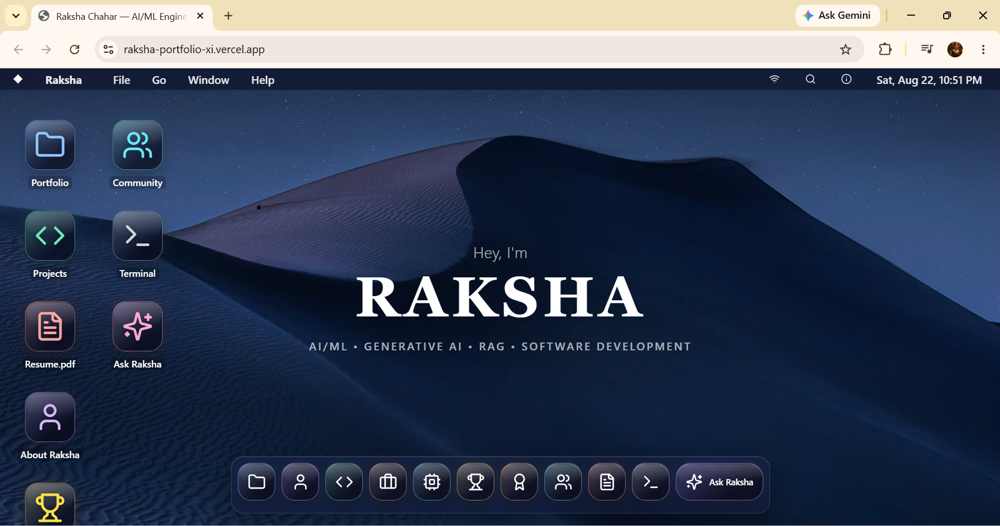
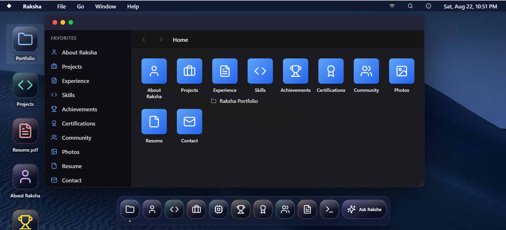
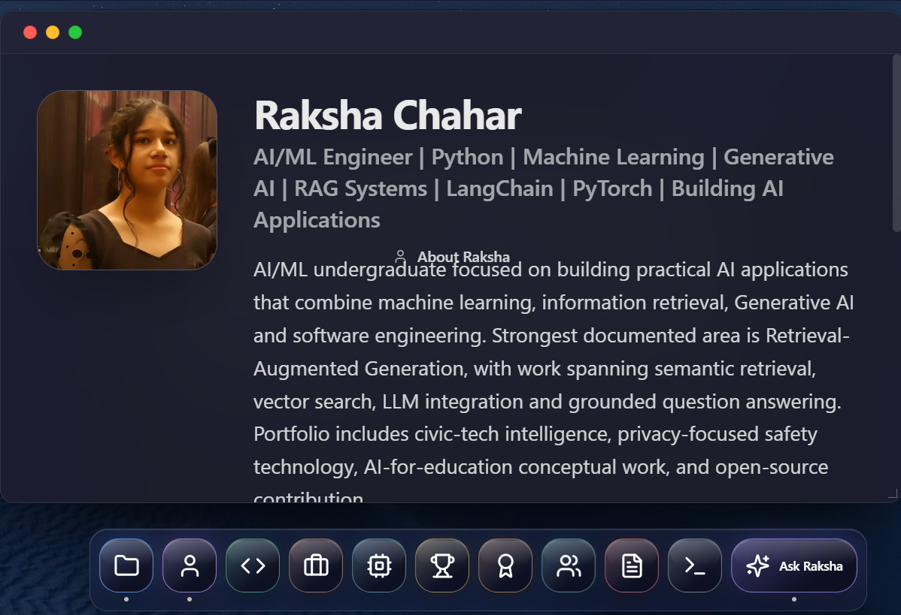
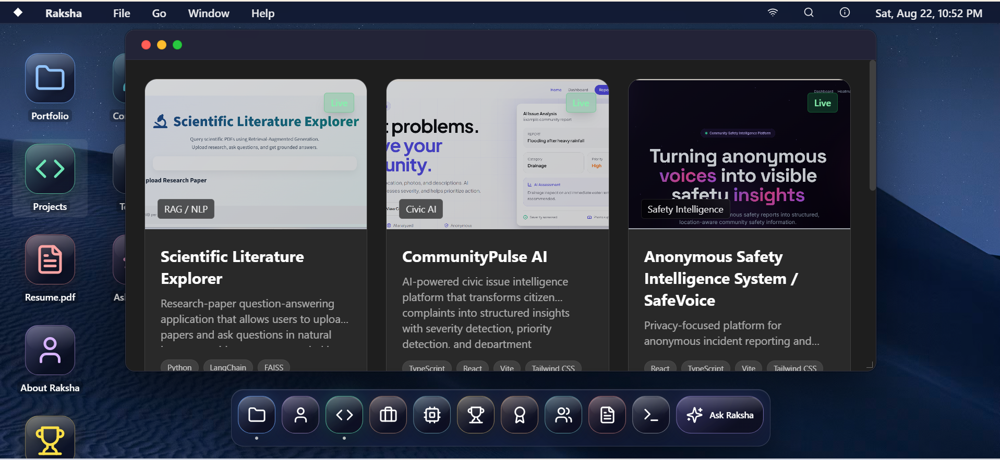
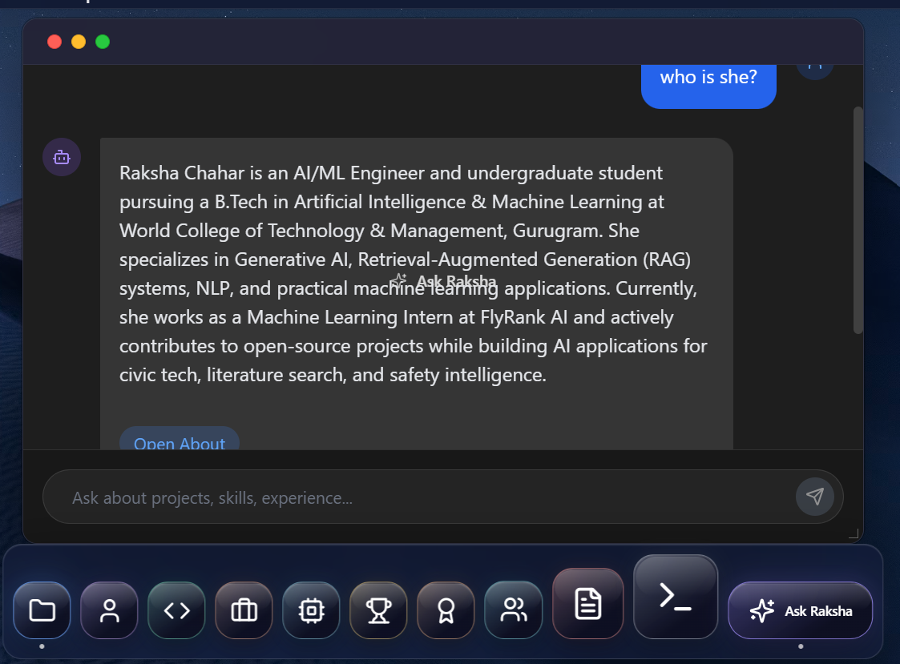
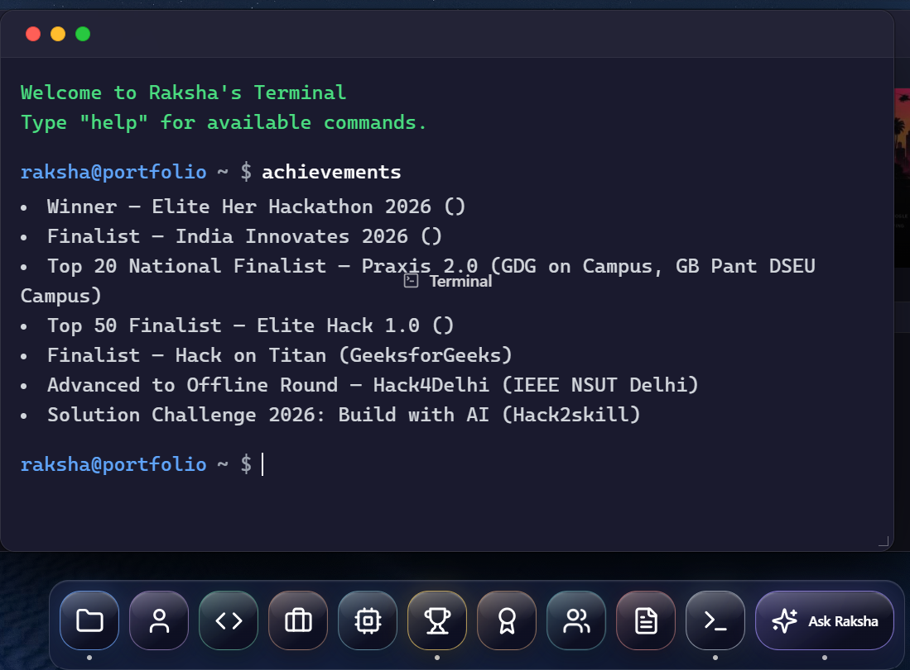

# 🖥️ Raksha Portfolio — Interactive AI/ML Developer Portfolio

> An interactive personal developer portfolio designed as a desktop-style experience to showcase AI/ML projects, experience, achievements, certifications, skills, and technical work.

---

## 🌐 Live Portfolio

Explore the deployed portfolio:

https://raksha-portfolio-xi.vercel.app/

The portfolio goes beyond a traditional scrolling website with an operating-system-inspired interface, application-style navigation, interactive windows, portfolio search, and an AI-powered **Ask Raksha** assistant.

---

## 🚀 Key Features

* Interactive desktop-style portfolio experience
* macOS-inspired interface with desktop icons, Dock, menu bar, and application windows
* Open, close, minimize, maximize, and focus management for windows
* Finder-style portfolio explorer
* Projects showcase with technology stacks, screenshots, GitHub repositories, demos, and limitations
* Dedicated sections for experience, education, skills, achievements, certifications, community, photos, resume, and contact
* Portfolio-wide search across structured profile information
* Dedicated responsive mobile experience
* AI-powered **Ask Raksha** assistant for natural-language questions
* Streaming AI responses using Google Gemini
* AI-generated navigation actions that can open relevant portfolio sections

---

## 🤖 Ask Raksha — AI Portfolio Assistant

**Ask Raksha** is the conversational AI layer of the portfolio.

Instead of manually navigating through different sections, visitors can ask questions about Raksha's professional background in natural language.

Example questions:

```text
What projects has Raksha built?

What AI/ML skills does she have?

Where has Raksha interned?

What is her RAG project about?

What technologies does she use?

Tell me about her experience.
```

The assistant uses structured portfolio information as its factual context and supports natural-language questions, paraphrasing, and conversational follow-ups.

### How it works

```text
Visitor
   ↓
Ask Raksha UI
   ↓
/api/ask-raksha
   ↓
Portfolio Context + Conversation History + Question
   ↓
Google Gemini API
   ↓
Streaming Response
   ↓
Ask Raksha UI
```

The server-side API route builds context from the portfolio's profile, education, experience, projects, skills, achievements, certifications, events, and contact information.

The current implementation uses the **Google Generative AI SDK** and keeps the Gemini API key server-side through the `GEMINI_API_KEY` environment variable.

### AI-to-UI integration

Ask Raksha can also return predefined actions such as:

```text
[OPEN_PROJECTS]
[OPEN_EXPERIENCE]
[OPEN_SKILLS]
[OPEN_ACHIEVEMENTS]
[OPEN_CERTIFICATIONS]
[OPEN_COMMUNITY]
[OPEN_RESUME]
[OPEN_ABOUT]
[OPEN_CONTACT]
```

The frontend converts these actions into interactive buttons that open the corresponding portfolio section.

This allows Ask Raksha to function as both a conversational assistant and an additional navigation layer for the portfolio.

---

## 🛠️ Tech Stack

| Technology                   | Purpose                                                    |
| ---------------------------- | ---------------------------------------------------------- |
| **Next.js 14**               | Application framework, routing, and server-side API routes |
| **React 18**                 | Component-based user interface                             |
| **TypeScript**               | Type-safe application development                          |
| **Tailwind CSS**             | Styling and responsive layouts                             |
| **Framer Motion**            | Animations and UI transitions                              |
| **Lucide React**             | Interface icons                                            |
| **Zustand**                  | Client-side window and application state management        |
| **Google Generative AI SDK** | Gemini API integration                                     |
| **Google Gemini**            | Natural-language generation for Ask Raksha                 |

---

## 📂 Portfolio Sections

The portfolio organizes professional information into interactive applications rather than one long page.

### 👩‍💻 About

Personal introduction, technical profile, education, skills, and professional information.

### 💻 Projects

Technical projects are presented with:

* Project purpose
* Category
* Technology stack
* Technical facts
* Status
* Screenshots
* GitHub repository
* Live demo where available
* Limitations

Projects currently represented include:

* **Scientific Literature Explorer**
* **CommunityPulse AI**
* **Anonymous Safety Intelligence System / SafeVoice**

### 💼 Experience

Currently documented experience includes:

* **Machine Learning Intern — FlyRank AI**
* **AI Automation & Intelligent Solutions Intern — BharatCares / IBM SkillsBuild with AICTE**
* **Open Source Contributor — GSSoC 2026, SSoC 2026 & Nexus Spring of Code**

### 🏆 Achievements

Selected achievements represented in the portfolio include:

* **Winner — Elite Her Hackathon 2026, Influencer & Communication Track**
* **Finalist — India Innovates 2026**
* **Top 20 National Finalist — Praxis 2.0**
* **Top 50 Finalist — Elite Hack 1.0**
* **Finalist — Hack on Titan**
* **Offline-Round Advancement — Hack4Delhi**

### 📜 Certifications

The portfolio includes certification and program records covering areas such as:

* AI Agents / Google ADK
* AI Fluency
* Machine Learning
* Data Analytics
* Postman APIs
* Python
* Hackathons and technical programs

### 📄 Resume

The portfolio provides access to Raksha's resume directly through the interface.

### 🔎 Search

The portfolio includes structured search across areas such as:

* Profile
* Projects
* Experience
* Skills
* Achievements
* Certifications
* Community & Events
* Resume
* Contact

### 📱 Responsive Experience

The project includes a dedicated mobile layout rather than simply shrinking the desktop interface.

---

## 🎨 Design & UX

The portfolio is intentionally designed around an operating-system-inspired experience.

The desktop interface includes:

* Wallpaper
* Desktop identity
* Application icons
* Dock
* Menu bar
* Finder-style navigation
* Application windows
* Window controls
* Interactive navigation
* Focus management
* Animated interactions

The mobile experience provides a simplified responsive interface while maintaining the overall visual identity of the desktop version.

---

## 📸 Screenshots

### 🖥️ Desktop Overview



---

### 📁 Portfolio Explorer



---

### 👩‍💻 About Raksha



---

### 💻 Projects



---

### 🤖 Ask Raksha AI Assistant



---

### 💻 Terminal



---

## 🧠 Engineering Highlights

### Component-Based Architecture

The interface is divided into reusable React components for desktop UI, applications, windows, mobile UI, search, navigation, and portfolio sections.

### Structured Portfolio Data

Professional information is centralized in structured portfolio data, providing a common source for profile information, education, experience, projects, skills, achievements, certifications, community activity, and search.

### Server-Side AI Integration

Ask Raksha communicates with Gemini through a Next.js API route, keeping the Gemini API key server-side rather than exposing it directly in client-side code.

### Streaming AI Responses

Ask Raksha streams Gemini's generated output to the browser, allowing responses to appear progressively.

### Client-Side Window State

Zustand is used to manage application and window state, supporting the interactive desktop behavior.

### Environment-Based Secrets

The Gemini API key is loaded through an environment variable and excluded from version control.

---

## ⚙️ Getting Started

### Prerequisites

* Node.js
* npm
* Git

### Installation

Clone the repository:

```bash
git clone https://github.com/rakshachahar/raksha-portfolio.git
cd raksha-portfolio
```

Install dependencies:

```bash
npm install
```

### Environment Variables

Create a `.env` file in the project root:

```env
GEMINI_API_KEY=your_gemini_api_key_here
```

The repository includes `.env.example` as a configuration template.

**Never commit your actual API key to GitHub.**

### Run Locally

Start the development server:

```bash
npm run dev
```

Open:

```text
http://localhost:3000
```

### Production Build

```bash
npm run build
npm start
```

---

## 🌐 Deployment

The portfolio is deployed on **Vercel**.

### Live Portfolio

https://raksha-portfolio-xi.vercel.app/

For the deployed **Ask Raksha** assistant to work, the production environment must have:

```text
GEMINI_API_KEY
```

configured.

The API key is accessed server-side through the application and is not intended to be exposed to the browser.

---

## ⚠️ Current AI Limitation

Ask Raksha depends on the availability and quota of the configured Gemini API.

If the provider's rate limit or daily quota is exhausted, AI requests may temporarily fail. This does not affect the rest of the portfolio.

Potential future improvements include lightweight local retrieval or fallback behavior so portfolio questions can still receive useful responses when the AI service is temporarily unavailable.

---

## 🔮 Future Improvements

Planned or potential improvements include:

* Lightweight local retrieval for portfolio questions
* AI fallback behavior when Gemini is unavailable
* More efficient context selection for AI requests
* Further optimization of AI response latency
* Improved mobile feature parity
* Additional accessibility refinements
* More automated testing
* Additional project demonstrations and technical documentation

---

## 📌 Project Purpose

Raksha Portfolio was built to present an AI/ML-focused technical profile while also demonstrating software development and AI integration skills.

Rather than treating a portfolio as only a collection of personal information, the project turns the portfolio itself into an interactive software product.

It demonstrates work across:

* Artificial Intelligence & Machine Learning
* Generative AI
* Retrieval-Augmented Generation
* Frontend Development
* API Integration
* TypeScript
* React
* Next.js
* Responsive UI Development
* Interactive Application Architecture
* Git and GitHub workflows

---

## 👩‍💻 About

**Raksha Chahar**

AI/ML Engineer focused on **Python, Machine Learning, Generative AI, Retrieval-Augmented Generation, and building practical AI applications**.

Currently pursuing a B.Tech in Artificial Intelligence & Machine Learning at **World College of Technology & Management, Gurugram**, affiliated with Maharshi Dayanand University, Rohtak.

### Professional Links

* **GitHub:** https://github.com/rakshachahar
* **LinkedIn:** https://www.linkedin.com/in/raksha-chahar
* **Portfolio:** https://raksha-portfolio-xi.vercel.app/

---

## 🔗 Other Projects

* **Scientific Literature Explorer:** https://scientific-literature-explorer-rag.streamlit.app/
* **CommunityPulse AI:** https://community-pulse-ai.onrender.com/
* **Anonymous Safety Intelligence System:** https://anonymous-safety-intelligence-syste.vercel.app/

---

## 📄 License

This project is licensed under the [MIT License](LICENSE).

---
---

<p align="center">
  Built and designed by <strong>Raksha</strong> with Next.js, React, TypeScript, Tailwind CSS, and Gemini.
</p>
